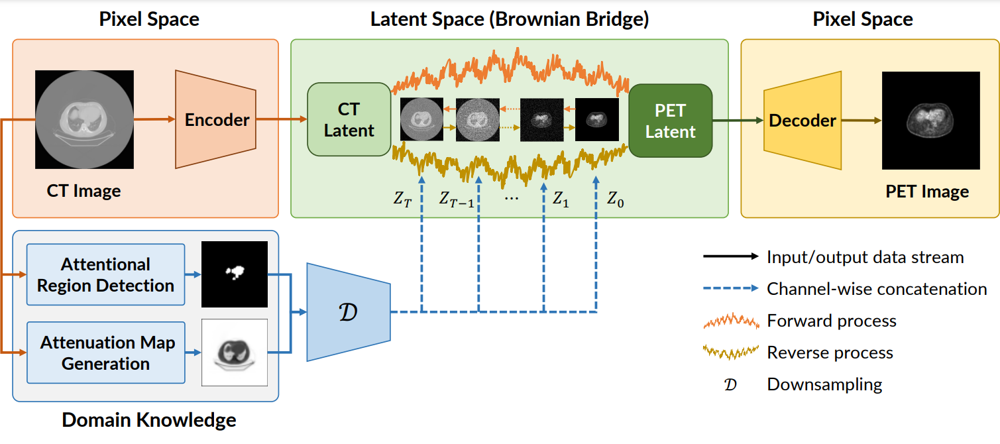

# CT to PET Translation: A Large-scale Dataset and Domain-Knowledge-Guided Diffusion Approach

This is the official implementation of **CPDM**, accepted for presentation at the IEEE/CVF Winter Conference on Applications of Computer Vision (WACV) 2025, to be held in Tucson, Arizona, from February 28 to March 4, 2025.

**Authors:** Dac Thai Nguyen, Trung Thanh Nguyen, Huu Tien Nguyen, Thanh Trung Nguyen, Huy Hieu Pham, Thanh Hung Nguyen, Thao Nguyen Truong, and Phi Le Nguyen.


## CT/PET Dataset
We provide a large-scale CT/PET dataset consisting of 2,028,628 paired PET-CT images. Please refer to the folder `CTPET_DATASET` to view a sample of the dataset.


## CPDM 
This repository contains the official implementation of the proposed CPDM. CPDM employs a Brownian Bridge process-based diffusion model to directly learn the translation from the CT domain to the PET domain, reducing the stochasticity typically encountered in generative models.



## Requirements
```commandline
cond env create -f environment.yml
conda activate CPDM
```

## Data preparation
The path of paired image dataset should be formatted as:
```yaml
your_dataset_path/train/A  # training reference
your_dataset_path/train/B  # training ground truth
your_dataset_path/val/A  # validating reference
your_dataset_path/val/B  # validating ground truth
your_dataset_path/test/A  # testing reference
your_dataset_path/test/B  # testing ground truth
```

## Train and test Segmentation Model for Object Detection in CT image
### Train your Segmentation Model
Specity your checkpoint path to save model and dataset path in <font color=violet><b>train_segmentation_model.py</b></font>. Run below command to train model.
```commandline
python train_segmentation_model.py
```
### Test your Segmentation Model
Specity your checkpoint path, dataset path and sampling path in <font color=violet><b>test_segmentation_model.py</b></font>. Run below command for sampling and saving results to your path.
```commandline
python test_segmentation_model.py
```
Note that you can modify this code for training, validation or testing sampling.

## Train and test CPDM
### Specify your configuration file
Modify the configuration file based on our templates in <font color=violet><b>configs/Template-CPDM.yaml</b></font>. Don't forget to specify your VQGAN checkpoint path, dataset path and corresponding training and validation/testing sampling path of your Segmentation Model.

Note that you need to train your VQGAN (https://github.com/CompVis/taming-transformers) and sample results of Segmentation Model before starting training CPDM.
### Run
Specity your shell file based on our templates in <font color=violet><b>configs/Template-shell.sh</b></font>. Run below command to train or test model.
```commandline
sh shell/your_shell.sh
```
